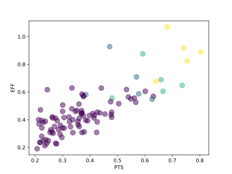
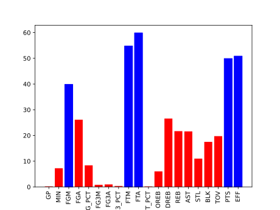

# All-NBA Teams predictions
This repository implements the process of obtaining and evaluating a machine learning model used to predict the players selected for the [All-NBA](https://www.nba.com/news/history-all-nba-teams) and [NBA All-Rookie](https://www.nba.com/news/history-all-rookie-teams) teams in a given season.

Project dependencies can be found in file *requirements.txt*. *All-NBA.ipynb* and *All-NBA-Rookies* Jupyter Notebooks are used to develop seperate models. General concepts and most of the code in both files are the same, but they are split between two notebooks for a more convenient workflow. *predict.py* script allows you to predict teams in a given season based on trained models. It must be run with one argument, which specifies path to results file with predictions in json format.

## Machine learning workflow description

### Data preparation and analysis
Project uses players performance statistics from the [nba.com](https://www.nba.com/stats/leaders?SeasonType=Regular+Season&PerMode=Totals) website, which are accessed through a client [API](https://github.com/swar/nba_api). Statistics are fetched for each regular season separately in a totals mode. Only 100 players who scored the most points in a given season are taken into account. Data from all specified seasons (1994-2024) is stacked up into one pandas DataFrame as in the table below. 

| SEASON   | PLAYER                  | TEAM   |   GP |   MIN |   PTS |   FGM |   FGA |   FG_PCT |   FG3M |   FG3A |   FG3_PCT |   REB |   EFF |
|:---------|:------------------------|:-------|-----:|------:|------:|------:|------:|---------:|-------:|-------:|----------:|------:|------:|
| 2023-24  | Luka Doncic             | DAL    |   70 |  2624 |  2370 |   804 |  1652 |    0.487 |    284 |    744 |     0.382 |   647 |  2580 |
| 2023-24  | Shai Gilgeous-Alexander | OKC    |   75 |  2553 |  2254 |   796 |  1487 |    0.535 |     95 |    269 |     0.353 |   415 |  2416 |
| 2023-24  | Giannis Antetokounmpo   | MIL    |   73 |  2567 |  2222 |   837 |  1369 |    0.611 |     34 |    124 |     0.274 |   841 |  2655 |
| 2023-24  | Jalen Brunson           | NYK    |   77 |  2726 |  2212 |   790 |  1648 |    0.479 |    211 |    526 |     0.401 |   278 |  1972 |
| 2023-24  | Nikola Jokic            | DEN    |   79 |  2737 |  2085 |   822 |  1411 |    0.583 |     83 |    231 |     0.359 |   976 |  3039 |
...
| 1994-95  | Terrell Brandon | CLE    |   67 |  1961 |   889 |   341 |   762 |    0.448 |     48 |    121 |     0.397 |   186 |   967 |
| 1994-95  | Bobby Phills    | CLE    |   80 |  2500 |   878 |   338 |   816 |    0.414 |     19 |     55 |     0.345 |   265 |   820 |
| 1994-95  | Spud Webb       | SAC    |   76 |  2458 |   878 |   302 |   689 |    0.438 |     48 |    145 |     0.331 |   174 |  1015 |

All-NBA teams picked in previous years are stored in the *targets.csv* file, where the first 15 names are players from three All-NBA teams, and the last 10 names are from two NBA All-Rookie teams. Data from this file is used to mark players in DataFrame with corresponding values (3 for first team, 2 for second, 1 for third and similarly for rookies). Vector of this data will be used then in machine learning process as target. Gathered data can be analyzed in an auxiliary dataframe, which may be used to detect any gaps in the data.

In next step the data is split between train and test dataframes based on seasons specified in a list (every fith year for default). The entire available set of features is passed to the pipeline then. The figure below shows a graphical distribution of the normalized values ​​of two sample features (efficiency and points), with All-NBA teams players marked with different colors.

### Model training and testing 
The implemented pipeline consists of three stages: data normalizer, feature selector and regressor. To normalize each feature individually into range from 0 to 1 [MinMaxScaler](https://scikit-learn.org/stable/modules/generated/sklearn.preprocessing.MinMaxScaler.html) method is used. In order to select a few features from available ones and reduce search space dimensionality an univariate feature selection method ([GenericUnivariateSelect](https://scikit-learn.org/stable/modules/generated/sklearn.feature_selection.GenericUnivariateSelect.html#sklearn.feature_selection.GenericUnivariateSelect)) is used. It is configured to select just 5 features based on univariate statistical tests. The bar plot below visualizes scores obtained for each feature, from which 5 best are selected.

At the end of the pipeline [RandomForestRegressor](https://scikit-learn.org/stable/modules/generated/sklearn.ensemble.RandomForestRegressor.html) estimator is used. Players with five highest values returned by regressor are chosen to the first All-NBA team. Similarly for the second and third fives and rookies. The metric used in program implements rules for receiving points within the project. Its values for test seasons are shown in the table below.

| SEASON | 1997-98 | 2002-03 | 2007-08 | 2012-13 | 2017-18 | 2022-23 | 2023-24 |
|:-------|:--------|:--------|:--------|:--------|:--------|:--------|:--------|
| SCORE  | 72      | 119     | 88      | 106     | 90      | 102     | 171     |

The result metric values ​​for the 2022-23 and earlier seasons are much lower than for the 2023-24 season. The reason for that is probably the change in rules for voting on All-NBA teams, because since 2023-24 the position in which the player plays doesn't matter. From seasons 1956 through 2023 voters selected two guards, two forwards, and one center for each team. These restrictions are not included in this project, so results for previous years are not as accurate. Obtained model should apply only for seasons 2023-24 and later. Detailed predictions for the 2023-24 All-NBA teams with each player's score (without bonuses) are shown below.

| PLAYER                  |   TARGET |   PRED_TARGET |   SCORE |
|:------------------------|---------:|--------------:|--------:|
| Luka Doncic             |        3 |             3 |      10 |
| Shai Gilgeous-Alexander |        3 |             3 |      10 |
| Giannis Antetokounmpo   |        3 |             3 |      10 |
| Nikola Jokic            |        3 |             3 |      10 |
| Jayson Tatum            |        3 |             3 |      10 |
| Anthony Edwards         |        2 |             2 |      10 |
| Kevin Durant            |        2 |             2 |      10 |
| Anthony Davis           |        2 |             2 |      10 |
| Jalen Brunson           |        2 |             1 |       8 |
| Kawhi Leonard           |        2 |             0 |       0 |
| LeBron James            |        1 |             2 |       8 |
| Devin Booker            |        1 |             1 |      10 |
| Domantas Sabonis        |        1 |             1 |      10 |
| Stephen Curry           |        1 |             0 |       0 |
| Tyrese Haliburton       |        1 |             0 |       0 |
| James Harden            |        0 |             2 |       0 |
| DeMar DeRozan           |        0 |             1 |       0 |
| Victor Wembanyama       |        0 |             1 |       0 |